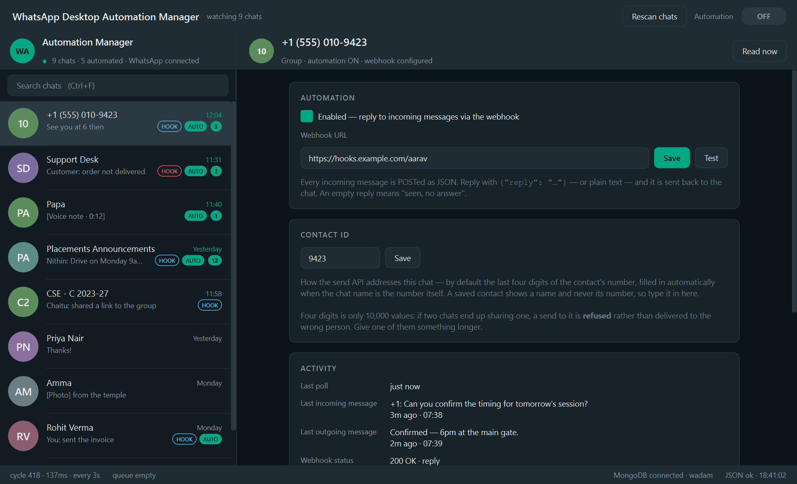

# WhatsApp Desktop Automation Manager

A dedicated automation engine for WhatsApp Desktop on Windows.

It watches your chat list through Windows UI Automation, registers every chat it
finds, and — for the chats you switch on — POSTs each incoming message to that
chat's webhook and sends whatever comes back. Everything is stored in MongoDB and
mirrored to readable JSON.

No AI. No generic desktop automation. No OCR. No settings window. It does one
thing.



---

## What it does, in order

```
startup
  ↓
load .env → validate → connect MongoDB → open JSON mirror → start UI Automation
  ↓
resume work that was in flight when the process last stopped
  ↓
deep-scan the WhatsApp chat list, register everything found
  ↓
┌─ every 3 seconds ────────────────────────────────────────────┐
│  read the chat list                                          │
│  compare with MongoDB → new chat? create it (automation OFF, │
│                          webhook empty) → save → write JSON  │
│  read the open conversation when it's worth reading          │
│  queue automated chats whose sidebar row changed             │
└────────────────────────┬─────────────────────────────────────┘
                         │
┌─ worker, one job at a time ──────────────────────────────────┐
│  open chat → read messages → save MongoDB → write JSON       │
│  → webhook → save response → write JSON                      │
│  → send reply (UI Automation) → verify → save → write JSON   │
└──────────────────────────────────────────────────────────────┘
```

After the initial `.env` configuration, no further intervention is expected.

---

## Quick start

```bash
python -m venv .venv
.venv\Scripts\python.exe -m pip install -r requirements.txt
copy .env.example .env
```

Edit `.env` (at minimum `MONGODB_URI`), then:

```bash
.venv\Scripts\python.exe run.py
```

Calling the venv's Python directly avoids PowerShell's execution policy blocking
`activate`, and avoids the Windows Store `python` alias.

Start WhatsApp Desktop and sign in. Chats appear in the left rail on their own —
there is no "add chat" step. Select one, paste a webhook URL, tick **Enabled**,
and it starts answering.

Requirements: Windows 10/11, Python 3.11+, WhatsApp Desktop, and a MongoDB you
can reach (a local `mongod` or an Atlas cluster).

---

## Documentation

| | |
|---|---|
| [ARCHITECTURE.md](docs/ARCHITECTURE.md) | Threads, module boundaries, message flow, design decisions |
| [DATA.md](docs/DATA.md) | MongoDB collections, the message lifecycle, JSON backup format |
| [UI.md](docs/UI.md) | Screen-by-screen walkthrough with screenshots |
| [SEND_API.md](docs/SEND_API.md) | The inbound HTTP API for sending messages |
| [RELAY.md](docs/RELAY.md) | Polling your webhook for outbound messages (winSpark's model) |
| [SENDING.md](docs/SENDING.md) | Option A in detail; options B, C and D analysed |
| [RELEASE.md](docs/RELEASE.md) | Validation results, benchmarks, readiness checklist, known limitations |
| [OPERATIONS.md](docs/OPERATIONS.md) | Architecture, lifecycles, health, supported environments, deployment |
| [HEADLESS.md](docs/HEADLESS.md) | Input-simulation audit, what WhatsApp's UIA provider really does, RDP |
| [LIMITATIONS.md](docs/LIMITATIONS.md) | Known limitations and future enhancements |
| [MIGRATION.md](docs/MIGRATION.md) | What came from winSpark, what was removed, how to move over |
| [TEST_REPORT.md](docs/TEST_REPORT.md) | Results, acceptance-criteria evidence, defects found |

---

## Configuration

Everything comes from `.env`. See [`.env.example`](.env.example) for the full,
commented list.

| Key | Meaning |
|---|---|
| `MONGODB_URI` | Primary datastore. Required. |
| `DATABASE_NAME` | Database for application collections. Never taken from the URI path. |
| `JSON_BACKUP_FOLDER` | Where the JSON mirror is written. Default `backup`. |
| `JSON_AUTOSAVE_INTERVAL` | Seconds the mirror coalesces writes over. `0` = write through. |
| `DEFAULT_WEBHOOK` | Webhook given to newly discovered chats. Optional. |
| `WEBHOOK_API_KEY` | Sent as `Authorization: Bearer …`. Optional. |
| `WEBHOOK_TIMEOUT` | Per-attempt HTTP timeout. |
| `WEBHOOK_MAX_RETRIES` | Retries on transport errors, 5xx and 429. |
| `WHATSAPP_WINDOW_TITLE` | Tie-breaker when the process owns several windows. |
| `LOG_LEVEL` | `DEBUG` / `INFO` / `WARNING` / `ERROR`. |
| `POLL_INTERVAL` | **Ignored.** The interval is fixed at 3 seconds in code. |
| `API_PORT` | Inbound send API. Empty = disabled. See [SEND_API.md](docs/SEND_API.md). |
| `API_HOST` | Bind address. Default `127.0.0.1` — unreachable from other machines. |
| `API_TOKEN` | Optional on loopback; **required** (16+ chars) for any other `API_HOST`. |
| `API_SEND_TIMEOUT` | Seconds a send request may take before returning 504. |
| `RELAY_ENABLED` | Poll each chat's webhook for outbound messages. Default off. |
| `RELAY_POLL_INTERVAL` | Seconds between polls of each chat's URL. Minimum 1. |

Startup is `load → validate → launch`. Anything invalid produces a startup
screen listing every problem at once, with a **Retry** button — so you can fix
`.env` in another window and try again without restarting.

---

## The webhook contract

Every incoming message in an automation-enabled chat is POSTed as JSON:

```json
{
  "event": "message.received",
  "app": { "name": "WhatsApp Desktop Automation Manager", "version": "1.0.0" },
  "chat": { "id": "a1b2…", "name": "Aarav Sharma", "is_group": false },
  "message": {
    "key": "…", "sender": "Aarav", "text": "Can you confirm the timing?",
    "direction": "in", "media_kind": "", "media_note": "",
    "time_text": "9:21 pm", "detected_at": "2026-08-06T09:21:44+00:00"
  }
}
```

Reply with any of these — all are understood, so the endpoint can be as simple
as you like:

```
{"reply": "Confirmed — 6pm."}     {"message": …}  {"text": …}
{"data": {"reply": …}}            "Confirmed — 6pm."     Confirmed — 6pm.
```

**An empty reply is a successful outcome, not an error.** `{"reply": ""}`, `{}`,
`204`, or an empty body all mean "seen, don't answer" — recorded, not retried.

Media messages arrive as readable placeholders (`[Voice note · 0:12]`,
`[Document: report.pdf]`, `[Photo] caption`) because the accessibility tree can
name an attachment but never hand over its bytes.

Retries cover transport failures, 5xx and 429 with exponential backoff. A 4xx is
the endpoint saying the request itself is wrong; repeating it verbatim would be
noise, so it fails immediately.

---

## Sending messages in (optional)

The webhook is the app telling you a message arrived. The **send API** is the
other direction — you telling the app to send one:

```bash
curl -X POST http://127.0.0.1:8765/wam/ -H "Content-Type: application/json" -d "{\"id\":\"9423\",\"message\":\"Hello Varshith\"}"
```

`id` is the chat's **contact ID** — by default the last four digits of the
contact's number, filled in automatically when the chat name is the number
itself, and typed into the configuration panel for a saved contact (WhatsApp
shows those by name and never reveals the number).

It is off unless `API_PORT` is set and binds to loopback by default, where a
token is optional; bind it anywhere else and a token becomes mandatory. The request blocks until the message has been **sent and
verified**, so a 200 means it actually arrived. If two chats share an identifier
the send is **refused with a 409**, never delivered to a guess.

Full reference: [SEND_API.md](docs/SEND_API.md).

### …or without opening a port

The **relay** is the same idea inverted, and it is what winSpark did: the app
`GET`s each automated chat's webhook and sends whatever comes back.

```
every 3s:  app ──GET https://your.server/hook──▶ your server
           app ◀── {"id":"42","message":"Hello Varshith"} ──┘
            └─▶ sent to that chat, deduped, persisted
```

Same URL as the outbound webhook — `POST` when a message arrives, `GET` to ask
whether anything is waiting. No listening socket, no open port, no token
crossing the network, and it works from behind NAT. Set `RELAY_ENABLED=true`.

Include an `id` when you can: it is how the same text can be sent twice on
purpose. Without one, a message identical to the last one relayed to that chat
is suppressed, so an endpoint that doesn't dequeue sends once and goes quiet
rather than repeating every few seconds.

Full reference: [RELAY.md](docs/RELAY.md).

---

## Storage

```
        MongoDB                              backup/
        ───────                              ───────
        chat_configs        primary          chats.json
        messages              │              messages.json
        webhooks              │  mirror      webhooks.json
        automation_logs       ├─────────▶    automation.json
        application_state     │              app_state.json
        poll_state            │              logs.json
                              │              settings.json  (credentials redacted)
```

MongoDB is authoritative. The mirror exists for crash recovery, debugging,
manual inspection, import/export and disaster recovery. Full schema in
[DATA.md](docs/DATA.md).

- **Nothing is edited in place.** A flush writes the whole file to a `.tmp`
  sibling, fsyncs, then `os.replace`s it — atomic on Windows for same-volume
  paths, so a reader sees the old complete file or the new one, never a
  half-written one.
- **Every write reaches JSON.** Writes coalesce over `JSON_AUTOSAVE_INTERVAL`,
  and a forced flush lands on every pipeline step, every user action and shutdown.
- **The mirror is fed from memory, not by re-querying MongoDB**, so a MongoDB
  outage degrades to "JSON keeps recording" rather than both stores stopping.
- If MongoDB starts empty and the mirror has chats, the mirror is loaded and
  written back, reported as a startup warning.

---

## Reliability

The requirements pull against each other: the safest way to never lose a message
is to retry everything, and the safest way to never duplicate is to retry
nothing. What reconciles them is knowing, for each message, **what the outside
world has already seen** — so the pipeline persists a state *before* each
irreversible step, not after.

| Crash point | On restart |
|---|---|
| after storing, before the webhook | resumed — the endpoint provably hasn't seen it |
| **during** the webhook call | parked as `interrupted` and logged; never auto-retried |
| after the reply, before sending | the chat is read first; sent only if the reply isn't already there |
| after sending, before recording | detected as already sent, marked replied, nothing re-sent |

Losing an automatic reply is recoverable. Sending someone's customer two of them
is not. See [DATA.md](docs/DATA.md#message-lifecycle).

---

## Behaviour worth knowing

**Discovery is not consent.** A newly discovered chat arrives with automation
OFF and (unless `DEFAULT_WEBHOOK` is set) no webhook.

**The backlog is never answered.** The first read of a chat records its visible
messages as `seeded` and triggers nothing.

**The global ON/OFF is a bulk action, not a master switch.** It writes
`automation_enabled` to every chat; afterwards individual chats can be toggled
and that choice stands.

**Only automated chats are opened.** Everything else is tracked from its sidebar
row, which costs nothing and disturbs nothing.

**A send is not "sent" until it's verified.** WhatsApp clears the compose box on
delivery; that empty box is the only accepted proof.

**A chat's identity is its name.** WhatsApp exposes no durable chat id, so
renaming a contact produces a new chat here — which fails safe, since it starts
with automation OFF.

---

## Sending

Windows UI Automation is the one supported transport, and it prefers UIA patterns
over simulated input at every step:

| Step | Preferred | Falls back to |
|---|---|---|
| Open a chat | `Invoke` / `SelectionItem` / `LegacyIAccessible` | viewport-checked click → search |
| Fill the input | `ValuePattern.SetValue` | clipboard paste → per-character Unicode |
| Send | `InvokePattern` on the Send button | `Enter` |

The fallbacks exist because the pure paths demonstrably fail on current WhatsApp
builds — `ValuePattern.SetValue` silently no-ops on the contenteditable compose
box **despite reporting `IsReadOnly = False`**. The pure rung is still tried
first so that the day WhatsApp implements it, sending becomes completely
invisible with no code change.

**Reading is fully headless** — no focus, no cursor, no keystrokes, verified by
a call-graph check that no read path can reach an input-simulating call.
**Sending is not, and cannot be**: the cursor never moves, but the window must
briefly take the foreground. The audit, the measurements behind that claim, and
why a disconnected RDP session stops sending are in
[HEADLESS.md](docs/HEADLESS.md). Full analysis,
including options B, C and D: [SENDING.md](docs/SENDING.md).

---

## Layout

```
wadam/
  config.py            .env loading + validation. The whole configuration surface.
  constants.py         Fixed values — the 3s interval lives here and nowhere else.
  domain/models.py     One dataclass per collection; the message lifecycle.
  storage/
    mongo.py           Primary. Connection, indexes, collections.
    json_backup.py     Mirror. Atomic controlled saves.
    repository.py      The facade every write goes through.
  whatsapp/
    sta_thread.py      The single STA thread that owns every UIA call.
    reader.py          Chat list + conversation reading. No OCR, no screenshots.
    sender.py          Option A. Opening, filling, sending, verifying.
    row_parser.py      Parses a flattened sidebar row into fields.
    name_rules.py      Truncation-tolerant chat-name matching.
  engine/
    engine.py          The 3s poll loop, its worker, and restart recovery.
    discovery.py       Automatic chat registration.
    pipeline.py        persist → webhook → persist → send → verify.
    webhook.py         The HTTP call and its retry policy.
  ui/
    main_window.py     WhatsApp's layout, configuration where the conversation goes.
    chat_list.py       Left rail.
    config_panel.py    Right panel.
    widgets.py         Chat-row painting.
    theme.py           Light and dark palettes.
    app.py             load → validate → launch.
```

Dependencies run one way: `ui → engine → {storage, whatsapp} → domain`. Nothing
in `storage/` imports `whatsapp/` or vice versa, which is what makes the engine
testable with a fake reader and a fake database.

---

## Tests

```bash
python -m pytest
```

121 tests: the row parser against strings captured from a live window, the
webhook contract and retry policy, storage guarantees, discovery, the pipeline
end-to-end against a real HTTP server, restart recovery, the poll loop with
WhatsApp faked, UI behaviour headless, and a real-MongoDB suite that skips itself
when no server is reachable.

Not covered: sending. It drives a real WhatsApp window with real input, and a
test that passed would have delivered a message to a real person. Details and
results in [TEST_REPORT.md](docs/TEST_REPORT.md).
