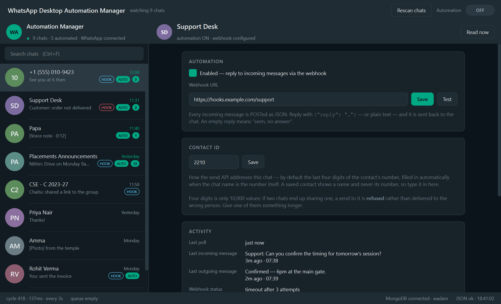
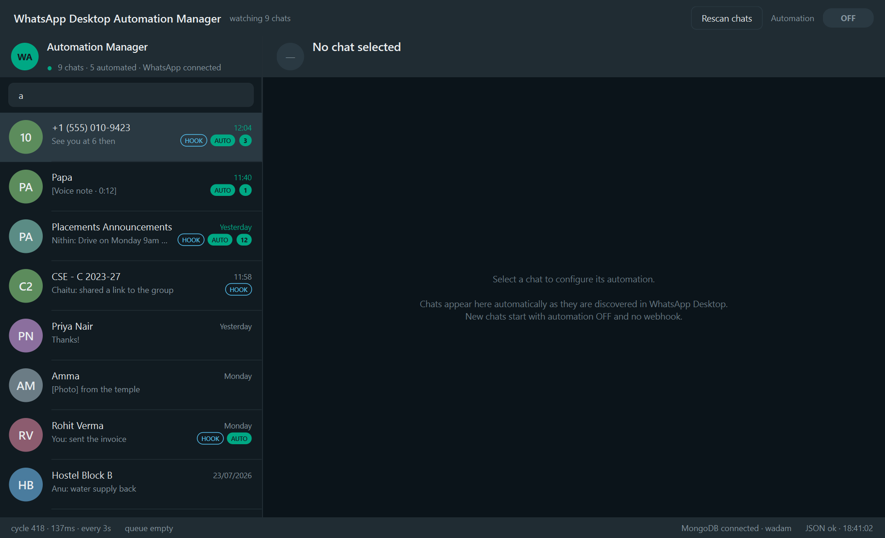
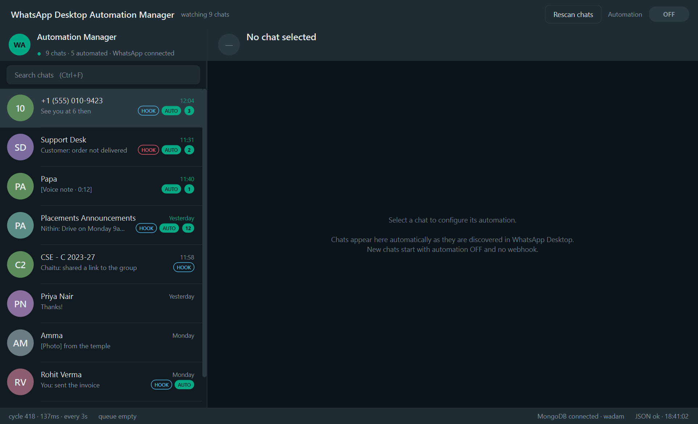
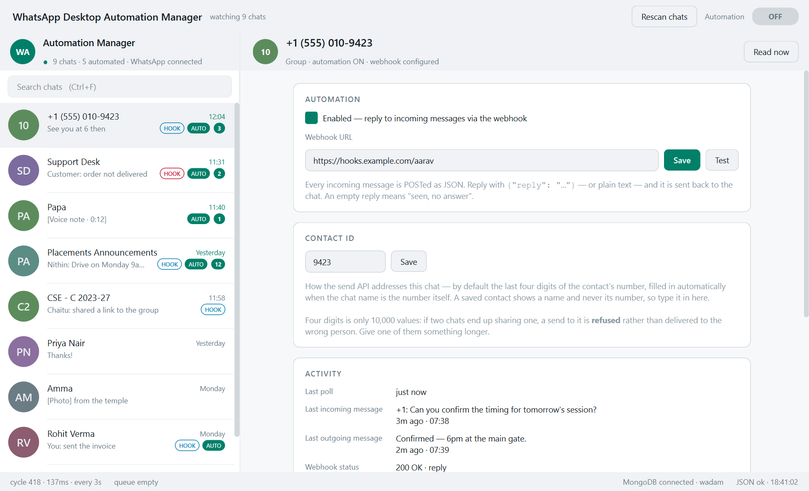
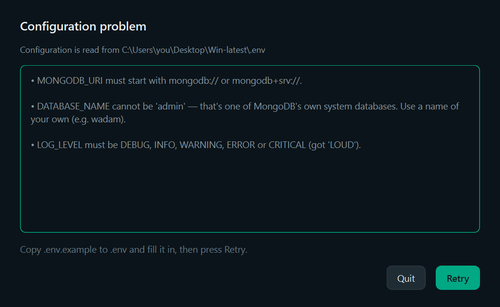
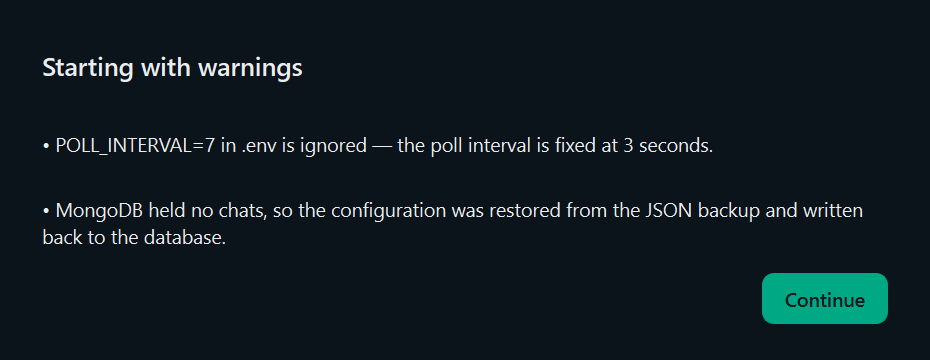

# Interface walkthrough

WhatsApp Desktop's layout, with per-chat automation configuration where the
conversation would be. Someone who uses WhatsApp should not need to learn
anything to find their way around.

---

## Main window

### Top bar

Application name, live engine state (`watching 9 chats`, `reading Alice…`,
`waiting for WhatsApp Desktop`), **Rescan chats**, and the global **Automation
ON/OFF** at top right.

The global switch is a **bulk action, not a master gate**: pressing it writes
`automation_enabled` to every chat, and afterwards individual chats can be
toggled and that choice stands. A gate would silently veto a chat switched on
after a global OFF. It asks for confirmation, naming the number of chats.

### Left rail

Does not collapse — it has a minimum and maximum width, so the splitter resizes
it within WhatsApp-like proportions and can never hide it.

* **Profile strip** — avatar, name, and a status line with a coloured dot:
  green when WhatsApp is connected, red when it is not. `9 chats · 5 automated ·
  WhatsApp connected`.
* **Search** — filters as you type, on both chat name and last message. No
  refresh button anywhere in the application. `Ctrl+F` or `Ctrl+K` focuses it;
  `Escape` clears it, then moves focus into the list, where the arrow keys
  navigate.
* **Chat rows**, 72px with a 49px avatar circle, ordered pinned → unread →
  most recent. Each shows avatar (initials, coloured by a hash of the name so it
  stays the same between runs), name, last message preview, timestamp, and
  badges:

| Badge | Meaning |
|---|---|
| **3** teal | unread count |
| **AUTO** teal | automation enabled for this chat |
| **HOOK** blue outline | a webhook URL is configured |
| **HOOK** red outline | …and its last call failed |

Look at Support Desk in the screenshot: a red HOOK, so its endpoint is failing
without having to click into it. Papa has AUTO but no HOOK — automation is on
with nowhere to send, which the panel spells out.

Hovering a row shows automation state, webhook URL, last webhook status and
messages stored.

### Right panel — configuration, not conversation

Header with the chat's avatar, name, a one-line summary, and **Read now** (open
this chat in WhatsApp and read it immediately rather than waiting for the poll —
it does switch the conversation WhatsApp is showing).

**Automation card** — the Enabled checkbox, the webhook URL with **Save** and
**Test**, and a one-line reminder of the contract. The URL is validated before
it is saved; `Save` reports success or the reason it failed, and `Test` POSTs a
`webhook.test` payload and shows the response.

The field always shows the selected chat's URL. It preserves unsaved text across
the once-a-second refresh, but switching chats always reloads it — the text
sitting there belongs to the chat you just left.

**Contact ID card** — how the [send API](SEND_API.md) addresses this chat.
Auto-filled with the last four digits when the chat name is the contact's
number (an unsaved contact); empty and editable for a saved contact, which
WhatsApp only ever shows by name. The card says out loud that four digits is
10,000 values and that a collision is refused rather than delivered to a guess.

**Activity card** — last poll, last incoming message (with sender and relative
time), last outgoing message, webhook status, last webhook response, retry
count, messages stored, last error. Values are selectable for copying and are
only rewritten when they change, so a selection survives the refresh.

**Storage card** — MongoDB status, JSON backup status, and the **Chat ID** in a
monospaced font, because its whole purpose is being pasted into a query.

**Actions** — Export JSON, Reset automation, and Delete chat (right-aligned,
red). Reset and Delete both confirm and say exactly what they will do.

### Status bar

Cycle count, last cycle duration, the fixed interval, queue depth, the send API
(only when enabled), and MongoDB / JSON health — red when any is unhealthy.

---

## A failing webhook

`timeout after 3 attempts` in Webhook status, the same text under Last error in
red, a retry count of 3, and the red HOOK badge in the rail. The chat keeps
recording messages throughout — a failing endpoint never costs you the message.

---

## Search

Instant, as-you-type, across name and preview.

---

## Nothing selected

States the model plainly: chats appear automatically, and new ones start with
automation OFF and no webhook. There is no "add chat" button because there is no
way to add a chat — WhatsApp decides what exists.

---

## Light theme

Follows the operating system's preference and switches live when it changes.
Avatar colours are deliberately identical in both themes — a contact whose
colour changed with the theme would be harder to recognise.

---

## Startup errors

`load → validate → launch`. A configuration problem stops the launch and shows
**every** problem at once, names the `.env` it read, and offers **Retry** — the
usual fix is to edit the file in another window, and making someone restart the
application to find out whether they got it right is a poor way to spend an
afternoon.

The same screen reports an unwritable backup folder or an unreachable MongoDB,
each with the specific next step (`mongod` not running, Atlas asleep, IP not
allow-listed, `pymongo[srv]` missing for an Atlas URI).

---

## Startup warnings

Non-fatal things worth saying out loud: a setting that does nothing (`POLL_INTERVAL`
is fixed in code), or MongoDB having come up empty so the configuration was
restored from the JSON backup. Startup continues either way.

---

## What is deliberately absent

There is no UI for the send API's port or token — like everything else, those
live in `.env`. The status bar shows whether it is listening; that is all.

No settings window. No refresh button. No "add chat" dialog. No confirmation when
a chat is discovered. No poll-interval control. No AI panel. The only dialogs are
the two startup screens and the confirmations on destructive actions.
